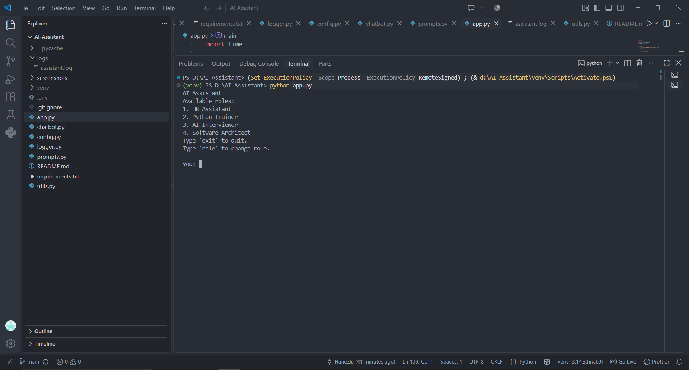
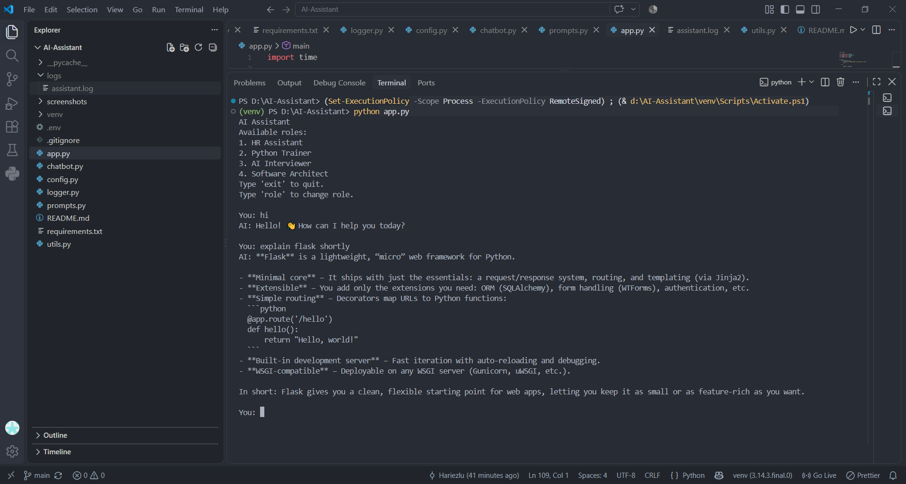
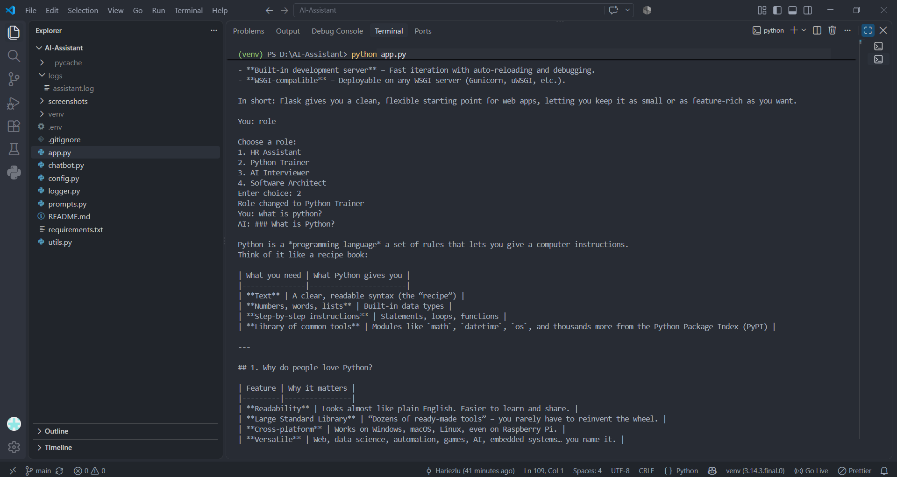
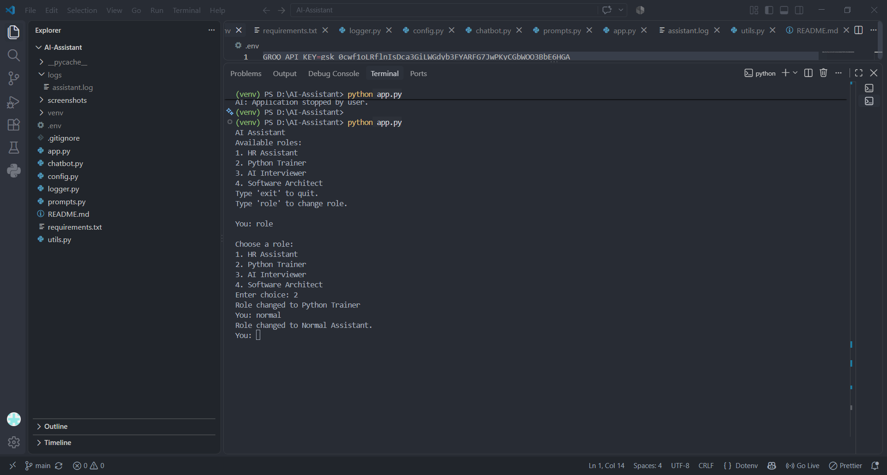
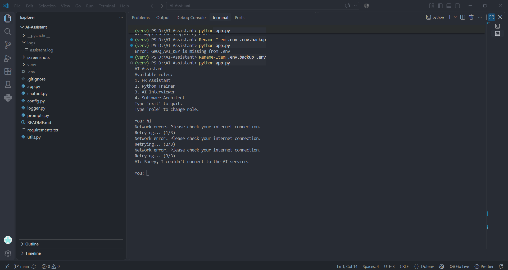
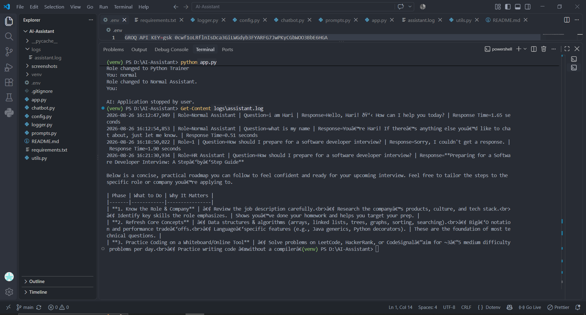

# AI-Powered Knowledge Assistant

## 1. Project Overview

The **AI-Powered Knowledge Assistant** is a Python-based conversational AI application that allows users to interact with an AI assistant through the command line.

The application starts in normal assistant mode and allows users to switch between specialized roles whenever required.

### Available Roles

1. HR Assistant
2. Python Trainer
3. AI Interviewer
4. Software Architect

The project also includes:

- Conversation history
- Retry mechanism
- API timeout handling
- Network error handling
- Prompt validation
- Missing API key handling
- Keyboard interrupt handling
- Application logging

---

## 2. Features

- Conversational AI
- Normal assistant mode
- Role-based assistant mode
- Dynamic role switching
- HR Assistant
- Python Trainer
- AI Interviewer
- Software Architect
- Conversation history
- Last 10 messages maintained
- Retry mechanism
- API timeout handling
- Internet connection error handling
- Missing API key handling
- Empty prompt validation
- Long prompt validation
- Keyboard interrupt handling
- Response time logging
- Environment variable configuration

---

## 3. Folder Structure

```text
AI-Assistant/
│
├── app.py
├── chatbot.py
├── config.py
├── prompts.py
├── logger.py
├── utils.py
├── requirements.txt
├── README.md
├── .env
├── .gitignore
│
├── logs/
│   └── assistant.log
│
└── venv/
```


## 4. Installation

### Step 1 — Clone the Repository

```bash
git clone <YOUR_GITHUB_REPOSITORY_URL>
```

### Step 2 — Navigate to the Project

```bash
cd AI-Assistant
```

### Step 3 — Create a Virtual Environment

```bash
python -m venv venv
```

### Step 4 — Activate the Virtual Environment

Windows PowerShell:

```powershell
venv\Scripts\Activate.ps1
```

### Step 5 — Install Dependencies

```powershell
pip install -r requirements.txt
```

---

## 5. Environment Variables

Create a `.env` file in the root directory of the project.

Add your Groq API key:

```text
GROQ_API_KEY=your_groq_api_key
```


---

## 6. How to Run

First, activate the virtual environment:

```powershell
venv\Scripts\Activate.ps1
```

Then run:

```powershell
python app.py
```

The application will start in normal assistant mode.

Example:

```text
AI Assistant
Available roles:
1. HR Assistant
2. Python Trainer
3. AI Interviewer
4. Software Architect
Type 'exit' to quit.
Type 'role' to change role.

You:
```

---

## 7. Normal Assistant Mode

The application starts without selecting a specialized role.

Example:

```text
You: What is Python?

AI: Python is a high-level programming language...
```

The assistant responds as a general-purpose AI assistant.

---

## 8. Role-Based Assistant

To select or change a role, type:

```text
role
```

The application displays:

```text
Choose a role:
1. HR Assistant
2. Python Trainer
3. AI Interviewer
4. Software Architect

Enter choice:
```

### HR Assistant

Select:

```text
1
```

The assistant provides HR-focused responses.

### Python Trainer

Select:

```text
2
```

The assistant explains Python concepts with examples.

### AI Interviewer

Select:

```text
3
```

The assistant acts as a technical interviewer and provides feedback.

### Software Architect

Select:

```text
4
```

The assistant provides guidance about software architecture and system design.

---

## 9. Return to Normal Mode

To remove the currently selected role, type:

```text
normal
```

Example:

```text
You: normal

Role changed to Normal Assistant.
```

The assistant will then return to normal conversation mode.

---

## 10. Conversation History

The chatbot maintains conversation history so that previous messages can be used as context.

The application limits the stored conversation history to the latest **10 messages**.

This helps control the amount of conversation data sent to the LLM.

When the user changes the assistant role, the conversation history is reset so the new role starts with a fresh context.

---

## 11. Retry Mechanism

The application includes a retry mechanism for failed API requests.

The application attempts a failed request up to **3 times**.

Example:

```text
Request failed. Retrying... (1/3)
Request failed. Retrying... (2/3)
Request failed. Retrying... (3/3)
```

If all attempts fail, the application displays a friendly error message instead of terminating unexpectedly.

---

## 12. Error Handling

The application handles several common errors.

### Missing API Key

If the API key is missing:

```text
Error: GROQ_API_KEY is missing from the .env file
```

The application exits without displaying a Python traceback.

### Empty Prompt

If the user submits an empty prompt:

```text
Please enter a question.
```

### Long Prompt

Prompts exceeding the configured character limit are rejected before being sent to the LLM.

```text
Prompt is too long. Please keep it under 2000 characters.
```

### Internet Failure

If a network connection error occurs, the application displays a network error and retries the request.

### API Timeout

If an API request times out, the application retries the request.

### Keyboard Interrupt

If the user presses:

```text
Ctrl + C
```

the application exits gracefully.

---

## 13. Logging

The application stores logs in:

```text
logs/assistant.log
```

The log records:

- Timestamp
- Selected role
- User question
- AI response
- Response time

Example:

```text
Role=Python Trainer |
Question=What is a Python list? |
Response=... |
Response Time=2.61 seconds
```

Logging helps with debugging, monitoring, and understanding application performance.

---

## 14. Screenshots

### Application Startup



### Normal Conversation



### Role Selection



### Role Switch to Normal Assistant



### Retry Mechanism



### Application Logs




```text
logs/assistant.log
```

---

## 15. Future Improvements

Possible future improvements include:

- Web-based user interface
- FastAPI backend
- Database integration
- Persistent conversation storage
- User authentication
- Streaming responses
- Document upload
- Document question answering
- Retrieval-Augmented Generation (RAG)
- Vector database integration
- Voice input
- Voice output
- Docker deployment
- Cloud deployment

---

## 16. Security

The application uses environment variables to store sensitive configuration such as the API key.

The API key should never be written directly inside Python source files.

The `.env` file must not be committed to GitHub.

---

## 17. Author

**Hari Haran**
